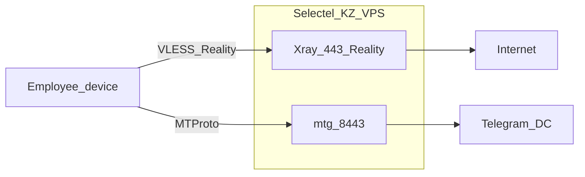

# План: Xray Reality + MTProto на Selectel

## Стек (фиксируем)

- **VPN:** Xray-core, inbound `VLESS + Reality` на `443/tcp`
- **Telegram:** [`mtg`](https://github.com/9seconds/mtg) на `8443/tcp`
- **Доставка:** Docker Compose в этом репозитории (`/home/maxim/projects/vpn`)
- **ОС VPS:** Ubuntu 22.04/24.04 (типичный образ Selectel)
- **Туннель:** полный (весь трафик сотрудника через VPS)
- **Домен не обязателен:** Reality с чужим SNI-dest (например `www.microsoft.com:443`)

## Что появится в репо

- `docker-compose.yml` — сервисы `xray`, `mtg`
- `xray/config.json` — шаблон Reality (порт 443, поток tcp, encryption none)
- `scripts/gen-reality.sh` — генерация `privateKey` / `publicKey` / shortIds через `xray x25519`
- `scripts/add-user.sh` — добавить сотрудника (новый UUID в config + перезапуск)
- `scripts/gen-mtproto.sh` — секрет и `tg://proxy?...` ссылка
- `.env.example` — IP VPS, порты, путь к ключам (без секретов в git)
- `README.md` — деплой на VPS + клиенты (Hiddify/Nekobox/v2rayN, iOS Happ/Streisand) + как выдать MTProto

Секреты (`UUID`, Reality keys, mtg secret) только в `.env` / локальных файлах на сервере, в git не коммитить.

## Настройка Xray (суть)

- Inbound: `vless`, `port: 443`, `security: reality`
- `realitySettings`: `dest` = `www.microsoft.com:443`, `serverNames` = `["www.microsoft.com"]`, свои `privateKey` + `shortIds`
- Clients: массив UUID (по одному на сотрудника)
- Outbound: `freedom` (прямой выход в интернет с VPS)

После деплоя — share-ссылка/QR вида `vless://UUID@IP:443?...security=reality&pbk=...&sid=...&sni=www.microsoft.com&fp=chrome&type=tcp`

## Настройка mtg

- Образ `nineseconds/mtg` (или актуальный аналог)
- Порт хоста `8443:3128` (внутренний порт контейнера по доке образа)
- Секрет: `mtg generate-secret --hex <домен-или-sni>`
- Выдача сотрудникам одной ссылки `tg://proxy?server=IP&port=8443&secret=...`

## Деплой на VPS (порядок работ)

1. Создать/проверить VPS Selectel KZ, открыть firewall: `443/tcp`, `8443/tcp`, SSH (желательно только с ваших IP)
2. Установить Docker + Compose
3. Скопировать репо на сервер, скопировать `.env.example` → `.env`, прописать публичный IP
4. Сгенерировать Reality-ключи и mtg-секрет скриптами
5. Добавить UUID сотрудников (`add-user.sh`)
6. `docker compose up -d`
7. Проверить: с телефона/ПК в РФ — VPN-клиент + Telegram через MTProto
8. Harden: SSH key-only, `ufw`, отключить пароли, не светить панель управления

## Выдача сотрудникам

| Нужно | Что дать |
|-------|----------|
| Интернет | VLESS-ссылка / импорт в Hiddify или Nekobox |
| Только Telegram | `tg://proxy` ссылка |
| Оба | оба профиля независимо |

При увольнении: удалить UUID из `config.json` и перезапустить Xray; для MTProto — сменить secret (все переподключатся) или завести второй инстанс mtg с другим секретом позже.

## Ограничения / риски

- Один IP Selectel: при массовых жалобах/абьюзе могут затронуть всех — выдавать ключи точечно
- Reality зависит от доступности `dest` SNI из РФ и с VPS; при проблемах сменить dest/SNI на другой популярный HTTPS-хост
- Не логировать содержимое трафика; хранить только UUID ↔ ФИО сотрудника вне репо

## Вне скоупа (сейчас не делаем)

- Панель 3X-UI / Marzban (можно позже, если надо self-service)
- Split-tunnel / рутинг только зарубежных сайтов
- Отдельный IP под MTProto на 443
